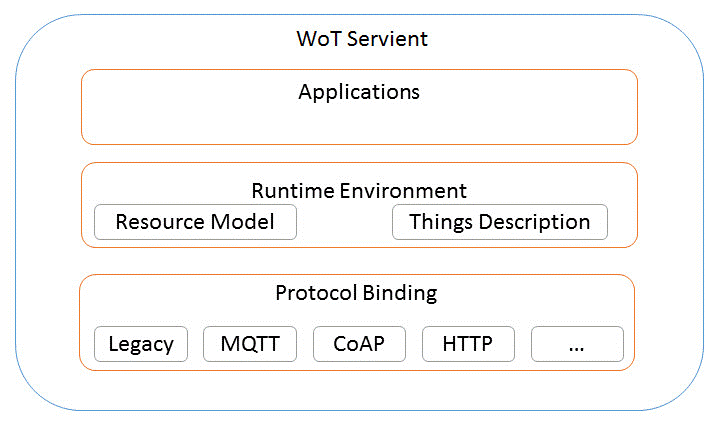
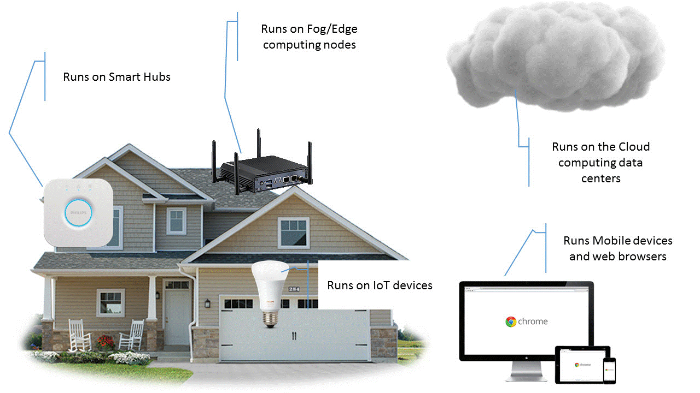
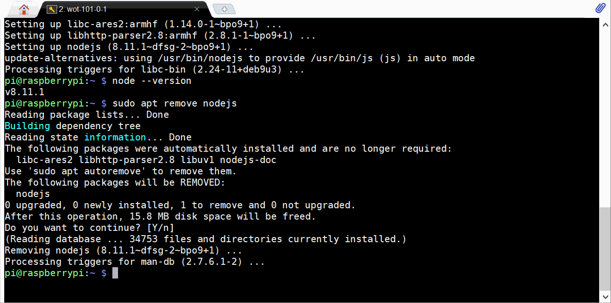
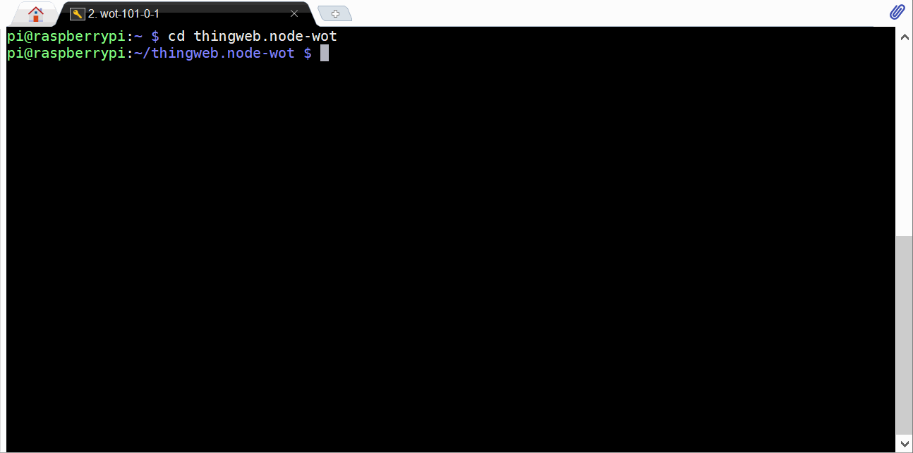

#Web of Things – first hands-on 

This document aims to introduce the Web of Things (WoT) as building blocks for applications based on the IoT devices. As a growing area, IoT services and application have a huge potential. From home automation to smart-grid passing by industrial manufacturers, IoT is gaining popularity as a potential solution to address their need. Several technologies can be used to build an IoT application mainly because of the specific constraints of the devices. This creates interoperability challenges for communication between devices. WoT offers an approach to expose and consume IoT resources as web resources.

##Introduction

WoT is an initiative by the W3C to apply on the IoT device the same principles as for the existing web resources across the Internet. The main idea behind WoT is exposing virtual or physical devices as a resource with a description of its capabilities. That resource can then be accessed from a browser or another device in the same manner as web page. WoT is not a proposition for a new communication protocol between devices, it uses existing protocols to communicate with the devices according to their communication capabilities. It presents a set of architectural and programming patterns for building interoperable devices base on the following three fundamentals:

+ Uniform Resource Identifier (URI) for identifying devices and their descriptions
+ A wide variety of existing protocols for accessing the devices
+ A description of the description as metadata used both for interoperability and presentability proposes

##WoT Architecture

The central component of the WoT architecture is “WoT Servient” which is functional virtual device. A Servient extends the IoT physical devices by providing standard access and controls capabilities to the devices.



A Servient provides a protocol agnostic runtime for the application using the resource model. Servient application uses this resource model which enable interoperability with other Serviants and users that are using multiple bindings. Servient may acts on the same time as a client and a server according to the applications' behavior. The resources associated to a Servient instance are described on a Things description. It uses JSON-LD to make this description readable by both humans and machine. Such a description enhances the machine to machine communication and makes the things ready for the Semantic Web.



A Servient instance can run on multiple platforms at different layer of the IoT network. It can be deployed inside the IoT device itself in condition to have a minimum processing power. It may also be deployed in side a smart hub or edge node to adapt legacy devices to the architecture. this adaptation role can also be provided by a Servient deployed on the cloud. last but not least, Servient Instances can be accessed as web resources by Smart phone and web browsers.

## Setup the raspberry pi zero w

We assume that the raspberry pi used is a freshly installed one with Debian. First, it needs to be configured for a network connection. Second, the environment needs to be configured mainly by installing NodeJS and few other dependencies. Finally, things-web needs to be installed on the system.

### Network configuration

Insert the SD card on your card reader and create the two following files as illustrated in the image below:


wpa_supplicant.conf: is the file that is used to configure your WiFi on command line. This file must contain the following configuration where **######** is your WiFi password

```bash
country=US
ctrl_interface=DIR=/var/run/wpa_supplicant GROUP=netdev
update_config=1
network={
        ssid="IoT-testbed-2.4"
        psk="#########"
        key_mgmt=WPA-PSK
        proto=RSN
        pairwise=CCMP
        group=CCMP
        auth_alg=OPEN
        }
```

###Installing nodeJS
Ideally, NodeJS 10 should be installed. It works also with NodeJS 8 but NodeJS 10 is highly recommended. To install the NodeJS version 10, make sure that the right architecture is used. Below the commands for the raspberry Pi zero w


```console
wot@node.wot:~$ node ../../../packages/cli/dist/cli.js wot101.js
wot@node.wot:~$ wget https://nodejs.org/dist/v10.15.0/node-v10.15.0-linux-armv6l.tar.xz
wot@node.wot:~$ sudo mkdir /usr/local/lib/nodejs
wot@node.wot:~$ sudo tar -xJvf node-v10.15.0-linux-armv6l.tar.xz -C /usr/local/lib/nodejs
wot@node.wot:~$ sudo mv /usr/local/lib/nodejs/node-v10.15.0-linux-armv6l /usr/local/lib/nodejs/node-v10.15.0
wot@node.wot:~$ nano ~/.profile

```


On the **~/.profile**, add the following:

```console
export NODEJS_HOME=/usr/local/lib/nodejs/node-v10.15.0/bin
export PATH=$NODEJS_HOME:$PATH
```


```console
wot@node.wot:~$ . ~/.profile
wot@node.wot:~$ node -v
wot@node.wot:~$ npm version
```


 

###Cloning the repository 

The reference implementation of the Web of Things is published in github as node.wot project at [github](https://github.com/eclipse/thingweb.node-wot) . The project is part of eclipse foundation.
Use the command below to clone the repository on your local system:

```console
wot@node.wot:~$ git clone https://github.com/eclipse/thingweb.node-wot
```



 

###Installation 

The installation process is composed from mainly two steps. The first step is installs the nodeJS dependences. The second step installs and build the node.wot project.

####Installing the packages

Node.wot requires dependencies such as Typescript, lerna, … . by running the command below, those dependencies are installed:

```console
wot@node.wot:~$ npm install
```


 

####Building the libraries 

As the node.wot project is mainly developed Typescript, “tsc” needs to be executed to trans-compile that code to JavaScript. The command bellows builds the projects and its packages:


```console
wot@node.wot:~$ npm run build
```


 

####Running the example Servient 

Run the command below to expose a “server” servient

```console
wot@node.wot:~$ node packages\cli\dist\cli.js examples\scripts\counter.js
```

You can access to the thing description generated at http://localhost:8080/counter 
 


##Things Description

The Things Description (TD) is one major element of the web of things approach. It is a json or jsonld object that describes a thing. As illustrated below, it describes aspects such as name, description, list of accessible properties and list of available actions.
 


###Properties

The property section describes interesting information about the exposed property as illustrated below. It offers also the “href” that defines the URI that the client can use to access to this property as a resource. 


###Actions

The actions describe the exposed actions exposed by the thing. They enable a client to remotely invoke the function associated to this action. Like for the properties, the actions expose a “href” URI that can be used to invoke those actions as illustrated below:
 


###Standard description

The full list of the elements that can be used in a TD is available on the W3C draft document available at https://www.w3.org/TR/wot-thing-description/ .

Once you create a Servient using the reference implementation, a TD respecting the standard is automatically generated for your exposed thing. The next section describes how to create a Servient and access to its TD.

##A Servient 

Web of Things programming model is based on the notion on “Servient”. A Servient is a program developed using the WoT scripting API and can behave at the same time as a server and a client.
For example, a Servient can be a client for a field device (light bulb) and server for the mobile application that is used to control that device.

###Servient’s structure 

As previously stated, a Servient can be both a client and a server. The structure of a servient varies depending on the target behavior. However, it is centered on the Thing Description. 
To expose a new thing (Server mode), you need first to create the thing my passing some metadata to the scripting API as illustrated below:

```javascript
let thing = WoT.produce({
      name: "counter",
      description: "counter example Thing",
      "@context": ["http://www.w3.org/ns/td", {"iot": "http://example.org/iot"}],
   });

```

This code initiates the creation of a thing named “counter” and adds metadata such as context to that thing.

Assume that our objective is to create a thing that implements few actions on a counter such as incrementation and decrementation.  For that we need to define the counter properties that we will manipulate on our example as bellow:
```javascript
thing.addProperty(
   NAME_PROPERTY_COUNT,
   {
      type: "integer",
      description: "current counter value",
      "iot:Custom": "example annotation",
      observable: true,
      writable: true
   },
   0);
```

This code will create the property, so it can be exposed and accessed both using the scripting API and using a binding (by default, the HTTP, and COAP bindings are used to expose things on node.wot).

Once your run the servient, the exposed property will be accessible at http://localhost:8080/counter/properties/count  as illustrated below:


Now that we have our property exposed, we can start adding our actions. An action as added to Serviant as described below:


```javascript
thing.addAction(
   NAME_ACTION_INCREMENT,
   {},
   () => {
      console.log("Incrementing");
      return thing.properties[NAME_PROPERTY_COUNT].read().then( (count) => {
         let value = count + 1;
         thing.properties[NAME_PROPERTY_COUNT].write(value);
      });
   });
```


Within an action, you can retrieve properties using the “read()” function and write the value to the thing once your value manipulated using the “write()” function.

The full counter example is available on the repository under “examples\scripts\counter.js”

###Client Mode

Node.wot allows you also to consume existing things exposed using the WoT. Assume that we have our counter example running on a machine, we can create a “client” to communicate with that counter.

First step is to create the thing that we are willing to consume. For that, we use the exposed thing descriptor to create that “client” thing as illustrated below:

```javascript
WoT.fetch("http://localhost:8080/counter").then( async (td) => {

let thing = WoT.consume(td);

}).catch( (err) => { console.error("Fetch error:", err); });

```

The created thing enables access to all the properties and actions exposed by the “server” thing. They can be accessed as described below:

```javascript
// read property #1
let read1 = await thing.properties.count.read();
console.info("count value is", read1);
```


```javascript
// increment property #1
await thing.actions.increment.invoke();
let inc1 = await thing.properties.count.read();
console.info("count value after increment #1 is", inc1);
```


Modifying those properties of invoking the actions results on modifications on the “server” thing.
The full client example is available on the repository at examples\scripts\counter-client.js

##Conclusion

WoT presents interesting approach to build IoT application. It adoption by the industry will be a significant step towards fighting the risk of fragmentation that may limit the development of IoT applications. The scripting API provides a way 
##References

1. https://w3c.github.io/wot/architecture/wot-architecture.html#general-description-of-wot-servient
2. https://github.com/w3c/wot
3. https://webofthings.org/


